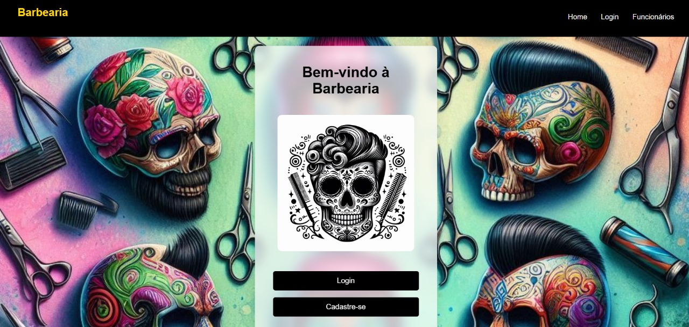
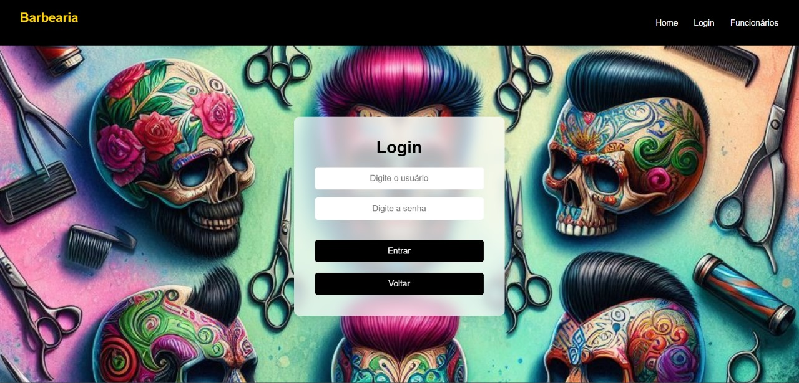
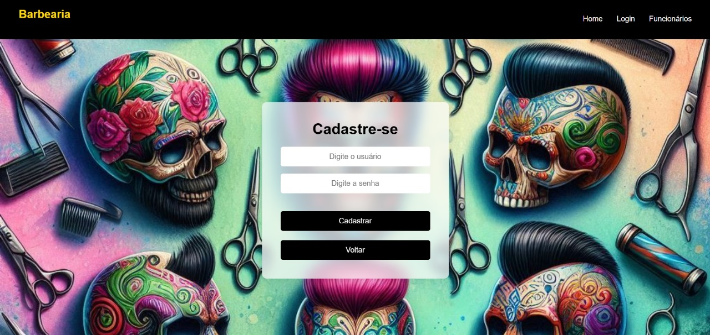
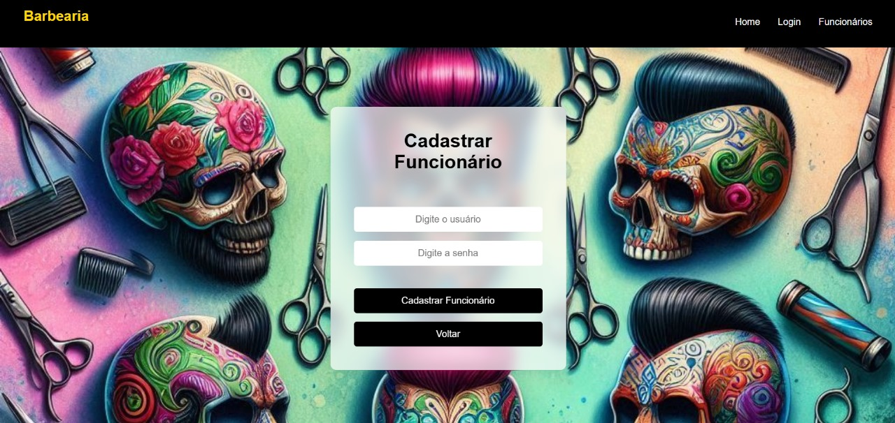
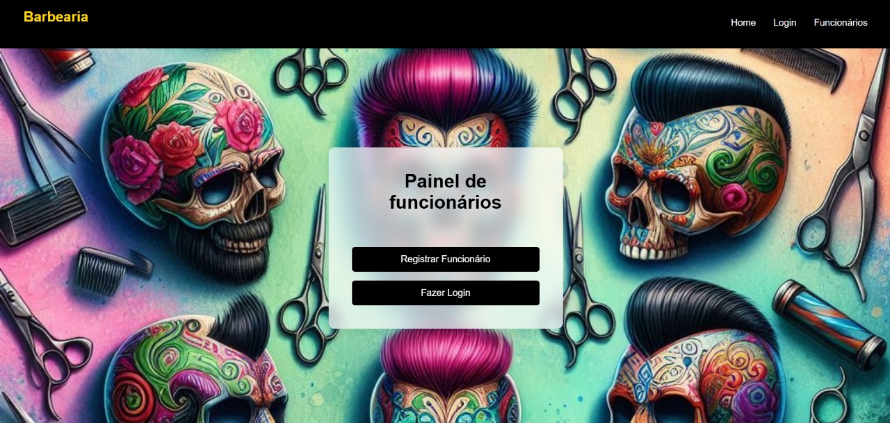
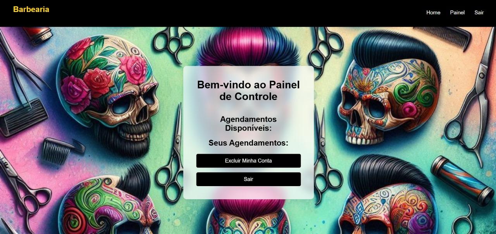
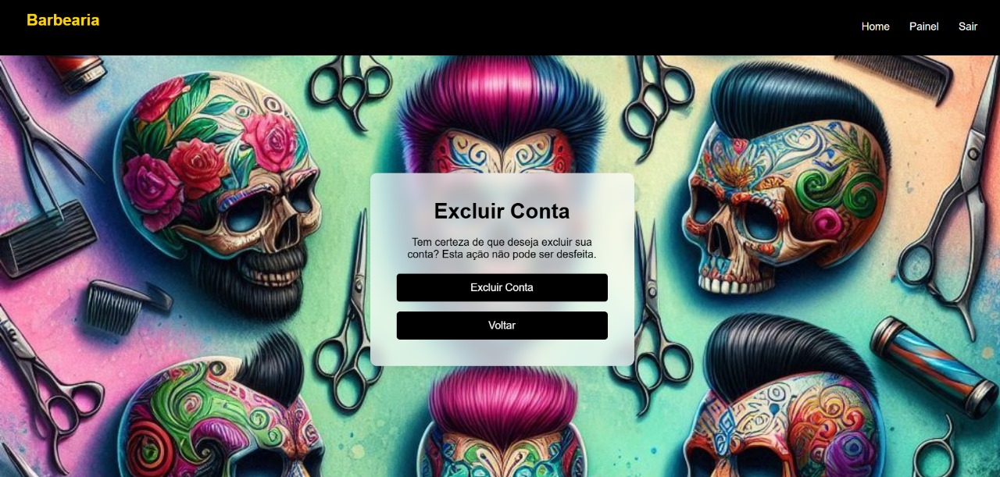

<h1 align="center">💈 crud_barbearia</h1>
<h3 align="center">Fortaleça Sua Barbearia, Simplifique Cada Agendamento</h3>

<p align="center">
  
  
  
</p>

---

## 🛠️ Construído com as ferramentas e tecnologias:

<p align="center">
  
  
  
  
  
</p>

---

## 📚 Índice

- [Visão Geral](#visão-geral)
- [Primeiros Passos](#primeiros-passos)
- [Pré-requisitos](#pré-requisitos)
- [Instalação](#instalação)
- [Uso](#uso)

---

## 📖 Visão Geral

O `crud_barbearia` é uma ferramenta de gerenciamento abrangente voltada para barbearias, projetada para facilitar o cadastro de funcionários e o agendamento de horários de maneira eficiente.

### Por que `crud_barbearia`?

Este projeto simplifica as operações da barbearia oferecendo uma interface amigável e uma funcionalidade robusta de backend. Os principais recursos incluem:

- ✅ **Cadastro de Funcionários Intuitivo:** Facilita a integração de novos membros com um formulário web simples.  
- 🔐 **Gerenciamento de Agendamentos Seguro:** Permite que usuários autorizados gerenciem horários e disponibilidades com eficiência.  
- 🧭 **Navegação Consistente:** Melhora a experiência do usuário com cabeçalho e rodapé padronizados em toda a aplicação.  
- 🛡️ **Autenticação Robusta:** Garante controle de acesso seguro com funcionalidades de login.  

---

## 🚀 Primeiros Passos

Para começar a usar o `crud_barbearia`, siga estes passos para configurar o projeto localmente.

---

## ✅ Pré-requisitos

- PHP 8.0 ou superior  
- Composer  
- Um servidor web como Apache ou Nginx  

---

## ⚙️ Instalação

```bash
# 1. Clone o repositório
git clone https://github.com/seu-usuario/crud_barbearia.git

# 2. Navegue até o diretório do projeto
cd crud_barbearia

# 3. Instale as dependências com o Composer
composer install

# 4. Configure o arquivo de ambiente
cp .env.example .env
# Edite o arquivo .env conforme necessário

# 5. Execute as migrações do banco de dados
php artisan migrate
```

---

## 💡 Uso

Após a instalação, você pode começar a usar o `crud_barbearia` para gerenciar sua barbearia:

- ➕ Adicionar novos funcionários  
- 📅 Agendar compromissos  
- 📆 Gerenciar disponibilidade  
- 🔐 Login e logout seguros  
- 📱 Interface responsiva e intuitiva  

---

## Protótipos

- Tela inicial do sistema



- Tela de login



- Tela de cadastro de clientes



- Tela de cadastro de funcionários 



- Painel iniciaç de funcionários 



- Painel de controle



- Tela exclusão permanente


---

<p align="center">
  Feito com 💈 para barbearias modernas!
</p>

